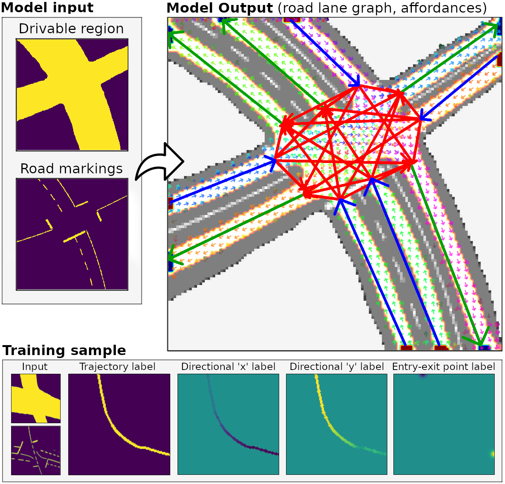
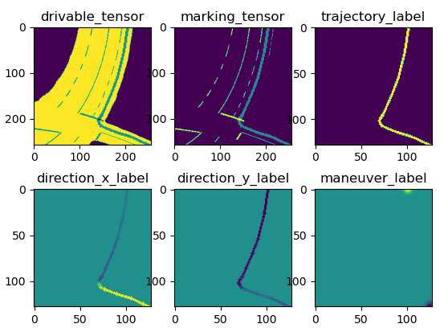
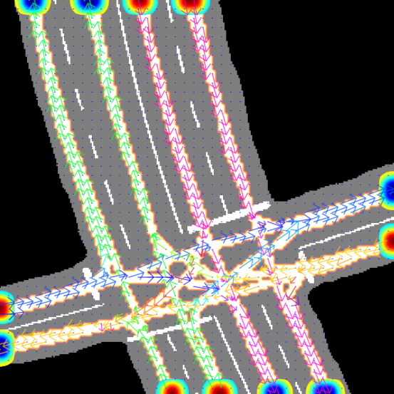
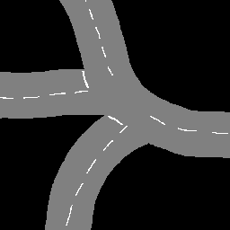
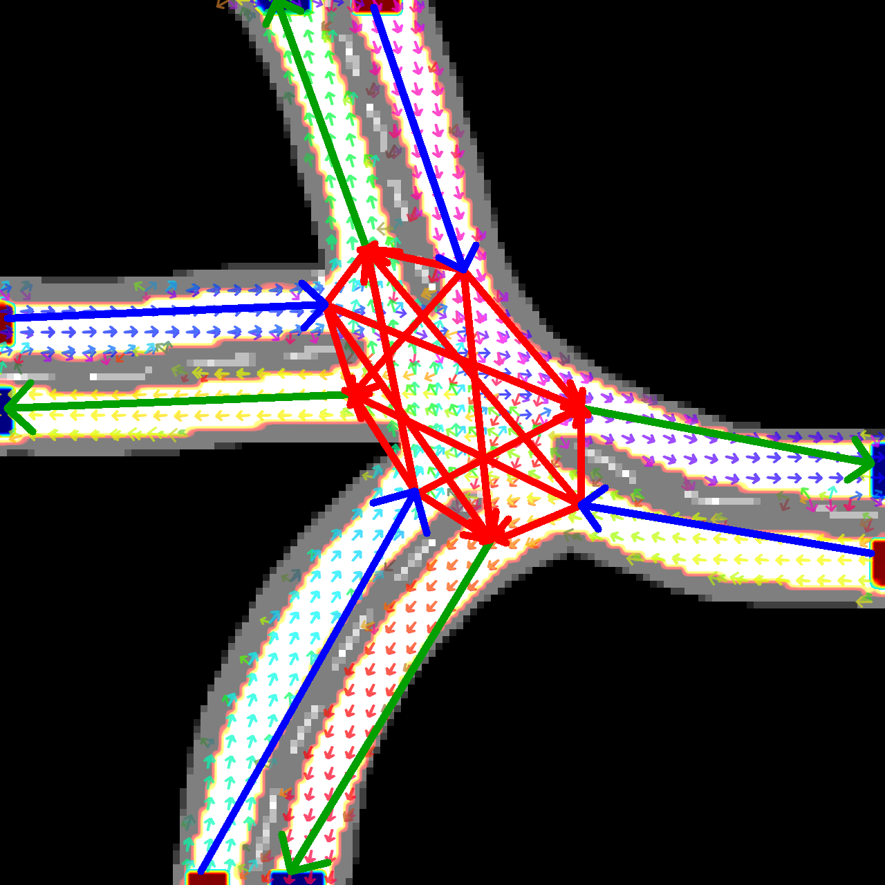

# Road Lane Network Graph Open
This repository contain code to reproduce results in the paper "Learning a Model for Inferring a Spatial Road Lane Network Graph using Self-Supervision" to be published at ITSC 2021.



### Dependencies
Python3
  - version: 3.6
  - packages:
    - scipy==1.5.2
    - numpy==1.19.1
    - matplotlib==3.3.4
    - torch==1.9.0
    - opencv_python==4.5.2.54
    - PyYAML==5.4.1

### TL;DR
```
# Set up environment and go to repository directy root

cd <path>/road_lane_network_graph_open/

export PYTHONPATH=.

pip install -r requirements.txt

# 1. Create examples (manual labor)

python data_gen/artificial/artificial_sample_gen.py data_gen/artificial/samples_intersection_1/
...

# 2. Generate training dataset

python datasets/train_set_gen.py

# 3. Generate evaluation datasets

python datasets/test_sample_gen.py

# 4. Generate visualization dataset

python datasets/viz_set_gen.py

# 5. Train model

python train/train.py

6. Try model

python try_model.py example_input.png checkpoint_75000.pt
```


# How to use

## 1. Create examples

Artificial 'raw samples' are created using `artificial_sample_gen.py`. This program loads samples from a directory containing semantic road scene context images (`standard_intersection_1.png`, etc.) and individual trajectories are generated according to user mouse clicks. Note that the click interval ought to be somewhat dense to allow trajectories to naturally curve during the sample warping process. The trajectories should be reasonably straight, mimicking actual human driving trajectories.

When using `artificial_sample_gen.py`, pressing 'n' saves the finished sample and prepares for the next sample. Pressing 'c' cancels the current sample to start from scratch. Pressing 'q' quits the current scene and goes to the next one. 

Example for generating samples for `samples_intersection_1`:
```
python data_gen/artificial/artificial_sample_gen.py data_gen/artificial/samples_intersection_1/
```

Raw samples used in the paper are provided pregenerated in their corresponding sample directory inside `data_gen/artificial/`.

## 2. Generate training dataset

The previously generated 'raw samples' are converted into 'training samples' and 'evaluation samples' by programs located in `datasets/`.

A training sample contain a single example trajectory and are used for training. Training samples can be geometrically augmented, meaning each sample feed to the model during training is unique.

1. Generate training samples

```
python datasets/train_set_gen.py 
```
A new directory `datasets/training_samples/` is created, containing training samples.

2. To speed up the training process, one can choose to pregenerate a large number of such augmented samples, which can be read directly by the dataloader during training. The paper uses a set of 1 million pregenerated samples.

```
python datasets/pregen_dataset.py 
```

Generated training samples (both ordinary and pregenerated ones) can be visualized by running
```
python viz/viz_dataset.py datasets/training_samples/ --augment
```



All training and evaluation samples used in the paper are provided pregenerated in their corresponding directory inside `datasets/`. The set of pregenrated training samples used for training in the paper can be downloaded from a [Google Drive directory](https://drive.google.com/drive/folders/1SnScGkU1x_yXnkWH1fGBatjK6zSGC9pG?usp=sharing) as `datasets/training_samples_pregen.tar`.

## 3. Generate evaluation datasets

1. An evaluation sample are generated by superimposing all identically augmented example trajectories of a scene, representing the ideal solution which is used to evaluate the quality of the model output.

```
python datasets/test_sample_gen.py
```

2. Evaluation sets are generated by arranging samples from the previously generated test samples, split into layouts seen during training (`training_eval/`) as well as new layouts (`test_eval/`)

```
python datasets/eval_set_gen.py
```

Generated test samples can be visualized by running
```
python viz/viz_test_sample.py datasets/test_samples/<scene_dir>/ <sample_idx>`
```



## 4. Generate visualization dataset

1. During every evaluation iteration, the visualization dataset is feed to the model, and the output is stored as image files.

Visualization samples are generated by running the following program, resulting in a new directory `datasets/viz_samples/`.
```
python datasets/viz_set_gen.py
```

## 5. Train model

The hybrid model consists of neural model ...

1. Modify the experiment configuration file `train/exp_params.yaml`.
```
hyperparams:
  init_learning_rate: 1e-3
  final_learning_rate: 1e-5
  final_learning_rate_step: 180000
  base_channels: 64  # Width of U-net architecture
  dropout_prob: 0.0

training_params:
  iter_max: 300000000
  print_interval: 100
  checkpoint_interval: 5000
  batch_size: 28
  num_workers: 24
  device: "cuda"
  pregen: True
  do_checkpoint: True
  do_eval: True
  do_viz: True

paths:
  train_set: "datasets/training_samples_pregen/"
  val_set_1: "datasets/training_eval"
  val_set_2: "datasets/test_eval"
  viz_set: "datasets/viz_samples"
  checkpoint_savedir: "exp_1/"  # Where to store training results
  viz_savedir: "exp_1/"
  logfile_savedir: "exp_1/"
  load_checkpoint:  # None or path
```

2. Run the training program
```
python train/train.py
```

NOTE 1: Large batch sizes are important for obtaining a sensible loss gradient. The results presented in the paper are obtained with a batch size of 28 samples, requiring 24 GB of GPU memory, which is the limit for a single RTX 3090. You can try to lower the batch size and modify the learning rate and stepping parameters in order to fit one training iteration into your system, but it will likely affect the results negatively.

NOTE 2: Additionally, the above program assumes the training, evaluation, and visualization samples are downloaded or generated following the instructions above.

## 6. Try model

You can try out a trained model on new road scenes generated by yourself.

1. Create a 256x256 semantic road scene image with the same proportions as the provided example image `img/example_input.png` (the relative proportions implicitly encodes distance information, and the data augmentation is not implemented to provide invariance to different "zooms" of the input samples).

The provided image was generated by hand using Gimp. Take care to draw the semantic information with the same RGB colors specified bellow. Make sure that no blurring operation is performed (i.e. resizing or rotatation with interpolation)

- Non-drivable: black (0,0,0)
- Drivable: gray (128,128,128)
- Road markings: white (255,255,255)

2. Run the inference program with your created road scene image and model checkpoint file.
```
python try_model.py example_input.png checkpoint_75000.pt
```

The neural model will output the dense road lane and directional information, and the search-based model will generate the road lane network graph. Both output will be drawn onto the input road scene image, saved as `0/dense_0_0.png` by default.

Example hand-drawn input image



Example result visualization



## File structure
```
road_lane_network_graph_open/
|
└───data_gen/
|   └───artificial/
|       └───scenes/                   # Directory with road scenes used in the paper
|       |   |    turn_.png
|       |   ...
|       |   artificial_sample_gen.py  # Creates raw samples with single trajectory
|
└───dataloader/
|   |   dataloader.py
|   |   dataloader_aux.py
| 
└───datasets/
|   |   eval_set_gen.py        # Partitions the testing samples --> training / test
|   |   pregen_dataset.py      # Creates a dataset of N pregenerated training samples
|   |   pregen_dataset_aux.py
|   |   test_sample_gen.py     # Converts raw samples to testing samples
|   |   train_set_gen.py       # Converts raw samples to training samples
|   |   viz_set_gen.py         # Converts raw samples to visualization samples
|
└───eval/
|   |   eval_aux.py
|   |   eval_dsla.py
|
└───graph/
|   |   a_star.py
|   |   dsla_weight_matrix.py
|   |   graph_func.py          # Main function for generating the graph
|   |   grid_map.py
|
└───inference/
|   |   inference.py
|
└───losses/
|   |   da_kl_div.py  # Directional affordance loss implementation
|   |   sla_l1_ce.py  # Dense affordance loss implementation
|   |   man_l1_ce.py  
|
└───models/
|   |   aspp.py
|   |   models_aux.py
|   |   unet_dsla.py  # Neural model implementation
|
└───preproc/
|   |   conditional_dsla.py
|   |   draw_gaussian.py
|   |   draw_trajectory.py
|   |   entry_point.py
|   |   file_io.py
|   |   image_rotation.py
|   |   line_seg_intersection.py
|   |   point_rotation.py
|   |   polynomial_warping.py
|   |   sample_gen.py
|   |   sample_gen_aux.py
|
└───train/
|   |   exp_params.yaml  # Experiment parameter configuration file
|   |   train.py         # Main training loop code
|
└───viz/
|   |   viz_dataset.py
|   |   viz_dense.py
|   |   viz_output_dsla.py
|   |   viz_test_sample.py
|
|   LICENSE
|   README.md
|   try_model.py  # Program to try model on custom input
```